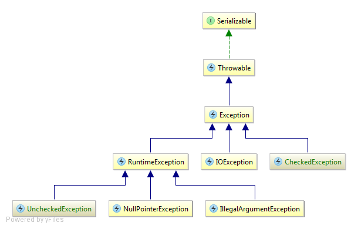

java-extended
==============

[![][license img]][license]

**This repository is no longer maintained - do not use (archived)**

Java Extended is an experimental set of libraries targeting JVM 1.6+

Available versions:

- [Guava](#jdkguava) 15.0, 16.0.1, 17.0, 18.0, 19.0
- [Joda Time](#java-time) 2.1, 2.3, 2.9.1
- [Hamcrest](#hamcrest) 1.3
- [Mockito](#mockito) 1.10.19
- [JUnit](#junit) 4.10, 4.11, 4.12

JDK/Guava
----------
JDK and Google's Guava extension library

    <dependency>
      <groupId>com.bluecatcode.guava</groupId>
      <artifactId>guava-19.0-extended</artifactId>
      <version>1.1.0</version>
    </dependency>

### Either
`Either` represents a value of one of two possible types, much like `Optional` but with both types definable.
Simple use case:

    public static Either<Exception, Integer> divide(int x, int y) {
        try {
            return Either.valueOf(x / y);
        } catch (Exception e) {
            return Either.errorOf(e);
        }
    }
    ...
    divide(10, 2).orThrow(unwrapToUncheckedException());

More complex use case:

    InputStream inputStream = either((CheckedFunction<URL, InputStream, IOException>) URL::openStream)
            .apply(new URL("http://example.com"))
            .orThrow(unwrapToUncheckedException());

### Contracts
Contracts can be defined using `Checks` for _recoverable, validation errors_ and `Preconditions`, `Postconditions`, `Impossibles`
for _unrecoverable, programming errors_, this distinction is very important and manifests itself in different
type of `Throwable` being used, an `Exception` for the former and an `Error` for the later.

Recoverable, __validation error__ checking usage cases range from simple:

    check(name, isNotNull());

to complex and parametrized:

    check(name, isNotnull(), CustomValidationException.class, "Expected valid name, got: '%s'", name);

where `isNotNull` is a predicate.

Unrecoverable, __programming errors__ checking use cases include `Preconditions`, `Postconditions`:

    public String doStuff(String input) {
        require(input != null, "Expected non-null input");

        String result = this.service.callStuff(input);
        ensure(result, isAsRequired())

        return result;
    }

and `Impossibles`:

    public static void closeQuietly(@WillClose @Nullable Closeable closeable) {
        try {
            close(closeable, true);
        } catch (IOException impossible) {
            impossible(impossible);
        }
    }

### Exceptions
`Exceptions` class provides some factory methods, mainly `exception` and `throwable`, along with `parameters` and `arguments`.
Usage example:

    throwable(throwableType, parameters(String.class),
              arguments(messageFromNullable(errorMessageTemplate, errorMessageArgs));

#### Exception hierarchy

Base exception classes `CheckedException` and `UncheckedException` are
clearly named with the intention for use with custom exception types for clear class hierarchy.

#### Special exceptions

- `VoidException` is an exception that cannot be thrown ever, an analogue of the `Void` type
- `WrappedException` is an unchecked exception used to wrap checked exceptions
                     in case an checked exception is not permitted or not desired

JUnit
-----
JUnit library extensions

    <dependency>
      <groupId>com.bluecatcode.junit</groupId>
      <artifactId>junit-4.12-extended</artifactId>
      <version>1.1.0</version>
    </dependency>

Hamcrest
--------
Hamcrest library extensions

    <dependency>
      <groupId>com.bluecatcode.hamcrest</groupId>
      <artifactId>hamcrest-1.3-extended</artifactId>
      <version>1.1.0</version>
    </dependency>

Mockito
---------
Mockito library extensions

    <dependency>
      <groupId>com.bluecatcode.mockito</groupId>
      <artifactId>mockito-1.10.19-extended</artifactId>
      <version>1.1.0</version>
    </dependency>

Joda Time
---------
Joda Time library extensions

    <dependency>
      <groupId>com.bluecatcode.time</groupId>
      <artifactId>joda-time-2.9.1-extended</artifactId>
      <version>1.1.0</version>
    </dependency>

Core (deprecated in version > 1.1.0)
------------------------------------
Core Java JDK extensions and backports

Functional Java Check (deprecated in version > 1.0.2)
-----------------------------------------------------
Functional Java test module (a.k.a. Reduction) library extensions

Build on Ubuntu Linux
---------------------

To build this project you'll need Oracle Java *7 and 8*

There are convinience scripts available:

    install_java7_and_java8.sh
    use_jdk_switcher.sh
    build.sh
    update_version.sh

To run a simple build use:

    source use_jdk_switcher.sh; mvn install

To run a more comprehensive build:

    source use_jdk_switcher.sh; mvn install jacoco:report -Penable-unit-tests,enable-integration-tests,enable-mutation-tests,enable-coverage-tests

Development
-----------

### Maven

Run single project (module) with dependencies, e.g. `guava` module with target `test`:

    mvn --projects guava --also-make test

Run single test:

    mvn -DfailIfNoTests=false -Dtest=StringsCapitalizeSpec test

Debug surefire:

    mvn -Dmaven.surefire.debug test

All together

    mvn --projects guava --also-make -DfailIfNoTests=false -Dmaven.surefire.debug -Dtest=StringsCapitalizeSpec test

[license]:LICENSE
[license img]:https://img.shields.io/badge/license-Apache--2.0-blue.svg
